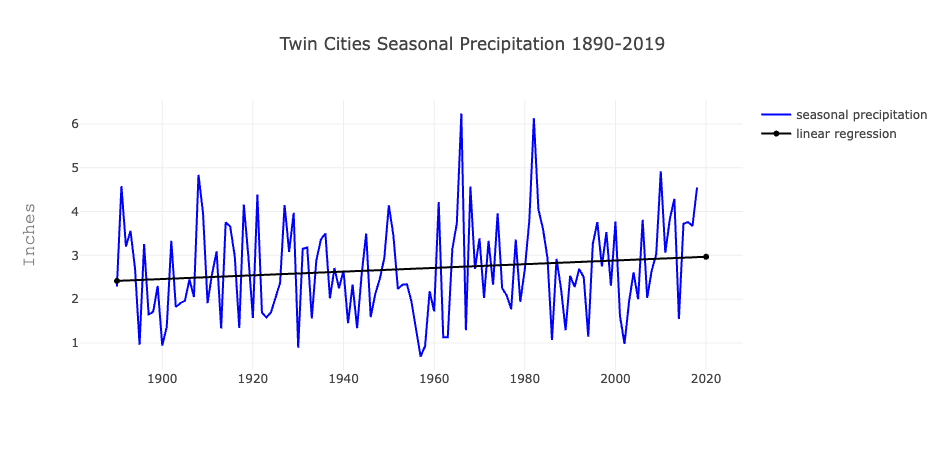
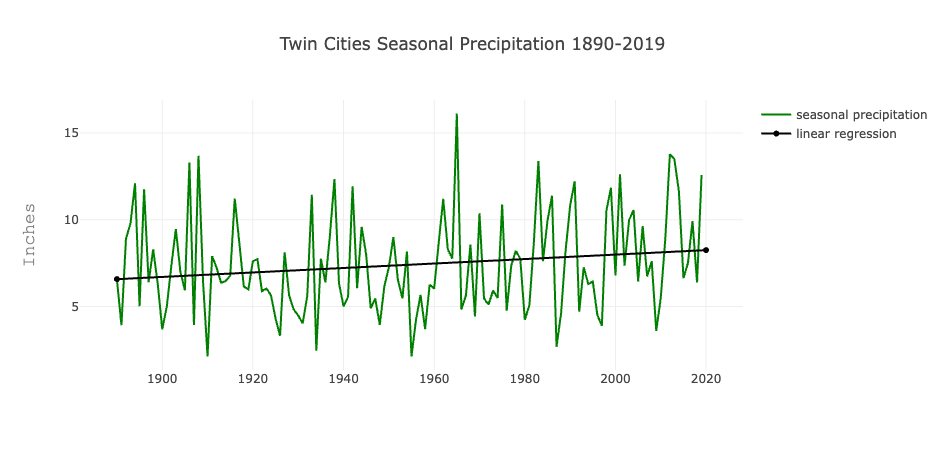
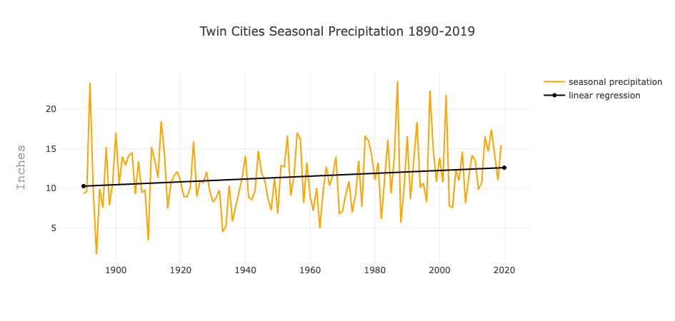
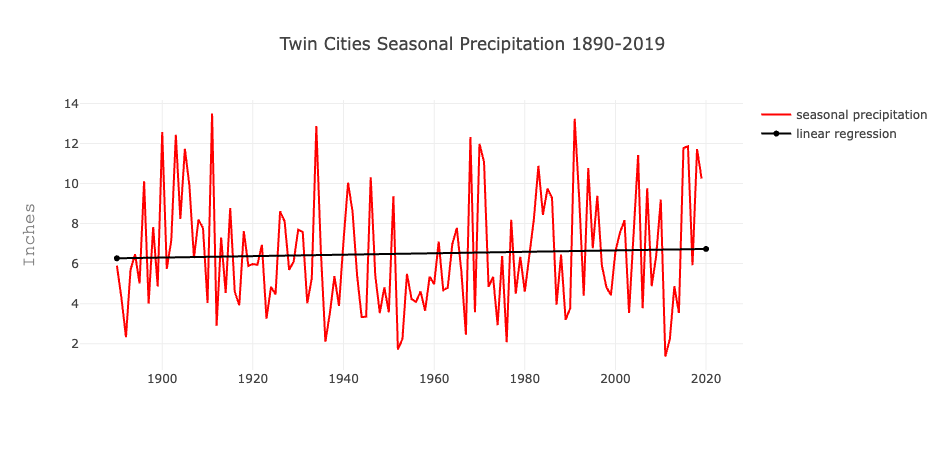
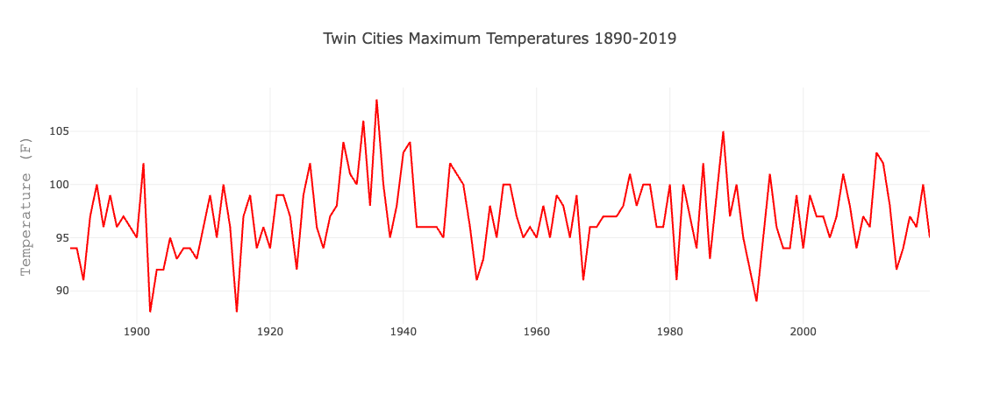

# project-3-group-9
# Twin Cities Climate Trends
## Purpose
To build an interactive dashboard to explore trends from the Twin Cities Historical Climate Dataset.
## Overview
The following is a to-do list for the requirements for Project 3:
### Data and Delivery
- [x] Data components used in the project are clearly documented.
- [x] The dataset contains at least 100 unique records.
- [x] A database is used to house the data (SQL, MongoDB, SQLite, etc.).
- [x] The project is powered by a Python Flask API and includes HTML/CSS, JavaScript, and the chosen database.
### Back End
- [x] The page created to showcase data visualizations runs without error.
- [x] A JavaScript library not shown in class is used in the project.
- [x] A dashboard page with multiple charts that all reference the same data.
### Visualizations
- [x] A minimum of three unique views present the data.
- [x] Multiple user-driven interactions (such as dropdowns, filters, or a zoom feature) are included on the final page.
- [x] The final page displays visualizations in a clear, digestible manner.
- [x] The data story is easy to interpret for users of all levels.
## Results
Winter Seasonal Precipitation

Spring Seasonal Precipitation

Spring Seasonal Precipitation

Fall Seasonal Precipitation

Maximum Temperatures

Total Snowfall

## Summary
With the linear regression lines there is a clear trend that the Twin Cities are getting slightly wetter but not enormously, it’s more visible in the winter, spring, and summer, not as visible in the fall.
## Notes
Data was obtained from Minneapolis/St. Paul Climate Data - Historical Climate Data Listings: https://www.dnr.state.mn.us/climate/twin_cities/listings.html
DB credentials used by the Flask application must be provided via a Python module called `keys.py`. See app.py for required variable names.
JavaScript library used (needed to be downloaded and installed): LinearRegression: https://github.com/thisancog/statistics.js
